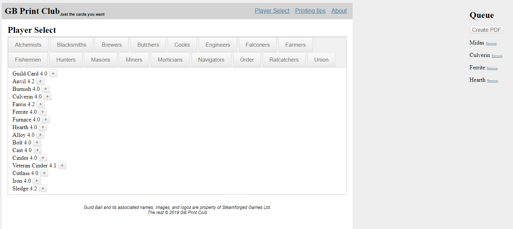

# gbprint.club
 ## A website to solve a problem that no longer exsisits
 
 I made this site for a tabletop game called Guildball. For a while new and revised cards were being released on a regular basis that needed to be printed. The problem was the company released all new and changed cards on pdf sheets with all the unchanged ones. So printing just the ones you needed was a pain. 
 
 I wrote a Python script that takes all the PDFs for the teams, and chops them up into individual cards. Than another script that can put them all back together anyway you want and export a pdf. Than I created a simple website with flask so you could select the cards you wanted and than generate a PDF. Shortly after I finished the game development slowed a lot, and than they just stopped. So at this point the cards are static and the website is pointless.

 The website uses a large ordered python dictionary that contains all the formatted character names and associated filenames organized by teams. This is used in a template engine to create all the tabs of the site and create the buttons for adding characters to the queue. This was done so I could easily update the list as new characters were added. When the create PDF button is pressed the list of filenames is sent to teh server which hands it off to the PDF creation script which puts all the requested images together and than serves a custom PDF to to user.

